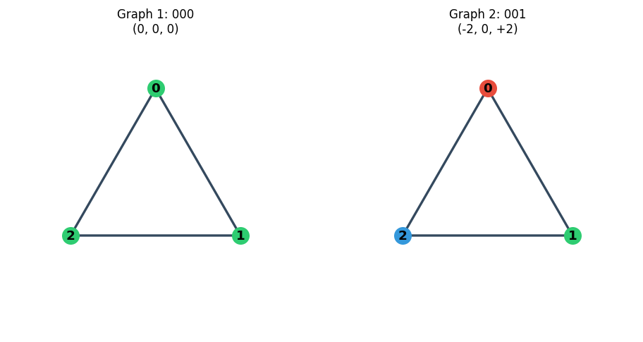
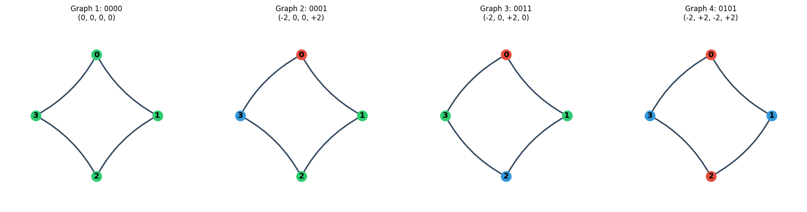

# Enumerating Oriented Cyclic Graphs Under Dihedral Symmetry

**A Report on Constrained Cyclic Graph Enumeration Using Transfer Matrices and Burnside's Lemma**

---

## 1. Motivation and Problem Statement

We study **oriented cycles on n edges**: a circle with n vertices where each edge is given a direction (forward or backward). Two such cycles are considered **equivalent** if one can be transformed into the other by rotating the circle or flipping it over (reflection). The central question is:

> **How many distinct oriented cycles of length n exist, up to rotation and reflection?**

This problem appears in chemical isomer enumeration (counting distinct molecular arrangements), combinatorial design theory, and the enumeration of necklaces with binary beads. The sequence of counts a(n) for n = 1, 2, 3, … is related to OEIS A053656.

---

## 2. Mathematical Setup

### 2.1 Encoding

- **Vertices and edges:** We have n vertices labeled 0, 1, …, n−1 arranged in a cycle. Edge i connects vertex i and vertex (i+1) mod n.

- **Edge direction:** Each edge is assigned 0 or 1:
  - **0:** direction vertex i → vertex (i+1)
  - **1:** direction vertex (i+1) → vertex i

- **Vertex signature:** At each vertex v, the two incident edges determine a value in {−2, 0, +2}:
  - Count how many of the two edges point **into** v.
  - 0 in → −2 (all out), 1 in → 0 (balanced), 2 in → +2 (all in).

  Formally: signature(v) = 2 × (edges in) − 2.

- **Example for edge sequence (0,0,1) on n=3:**
  - Edge 0: 0→1, Edge 1: 1→2, Edge 2: 0→2 (because bit 1 means reverse)
  - Vertex 0: both edges out → −2
  - Vertex 1: one in, one out → 0
  - Vertex 2: both in → +2  
  - Vertex signature: (−2, 0, +2)

### 2.2 Dihedral Symmetry

Two cycles are equivalent if they differ only by:

1. **Rotation:** Shifting labels 0,1,…,n−1 by k positions (cyclic permutation).
2. **Reflection:** Reversing the cycle order and flipping every edge (0↔1).

The symmetry group is the **dihedral group D_n** of order 2n. We count **orbits** under this group.

### 2.3 Canonical Form

We choose a unique representative per orbit: the **lexicographically smallest** edge sequence among all rotations and the reflected-and-rotated versions. For example, (1,0,0) and (0,0,1) are the same up to rotation; we keep one.

---

## 3. Optional Constraints

Beyond the basic setup, we can impose:

1. **Adjacency:** No two consecutive vertices (cyclically) may both be nonzero with the same sign. So (+2,+2) or (−2,−2) next to each other is forbidden; (+2,−2) or (0,±2) is allowed.

2. **Primitivity:** The pattern is not a repetition of a shorter cycle. E.g. (−2,+2,−2,+2) repeats (−2,+2), so it is not primitive for n=4.

3. **Forbidden subsequence:** No cyclic substring may match a canonical pattern from a smaller n.

For the main sequence, we use **adjacency only**. The adjacency rule has a natural interpretation (e.g. alternating flow in molecular applications).

---

## 4. Algorithm: Transfer Matrix + Burnside

Brute force over all 2^n edge assignments is O(2^n·n), infeasible for large n. We use two ideas:

### 4.1 Transfer Matrix

**State:** (last vertex value, current edge) ∈ {−2,0,+2} × {0,1} → 6 states.

**Transition:** From state (v, e), we choose the next edge e'. This fixes the next vertex v'. The adjacency rule restricts valid (v', e') pairs.

We build a 6×6 matrix M where M[s][t] = 1 if transition s→t is allowed. The number of **closed walks of length n** (cycles that return to the starting state) equals the **trace of M^n**.

Matrix power M^n is computed in O(log n) multiplications via binary exponentiation.

### 4.2 Burnside's Lemma

**Number of orbits = (1/|G|) × Σ (fixed points of each symmetry).**

- **Rotations:** A rotation by k positions fixes a cycle iff it has period d = gcd(n,k). We sum over divisors d of n: count of closed walks of length d, weighted by φ(n/d).
- **Reflections:** For even n, we count sequences fixed by “reverse + flip” using a half-length matrix power and boundary conditions.

**Final formula:** orbits = (rot_sum + reflection_term) / (2n).

### 4.3 Primitivity (Möbius Inversion)

For primitive-only counts:  
primitive(n) = Σ_{d|n} μ(d) × total(n/d).

---

## 5. Worked Example: n = 4

### 5.1 Brute Enumeration

There are 2^4 = 16 possible edge sequences. After reducing by rotation and reflection, we obtain **4 distinct cycles**:

| # | Edge (binary) | Vertex Signature |
|---|---------------|------------------|
| 1 | 0000          | (0, 0, 0, 0)     |
| 2 | 0001          | (−2, 0, 0, +2)   |
| 3 | 0011          | (−2, 0, +2, 0)   |
| 4 | 0101          | (−2, +2, −2, +2) |

**Interpretation:**
- **0000:** All edges same direction → every vertex balanced (0).
- **0001:** One reversed edge → vertex 0 sends both out (−2), vertex 3 receives both (+2).
- **0011:** Two consecutive reversed edges → alternating −2,0,+2,0.
- **0101:** Alternating directions → vertices alternate −2 and +2.

All four satisfy the adjacency constraint (no consecutive same-sign nonzero).

### 5.2 Verification via Burnside

For n=4, divisors are d ∈ {1,2,4}. We compute closed walks for each d, weight by φ(4/d), add the reflection term, and divide by 8. The result is 4.

### 5.3 Smaller Example: n = 3

For n=3 there are only **2** distinct cycles:
- **000:** All same direction → signature (0,0,0), triangle with all edges clockwise.
- **001:** One reversed → vertex 0: −2, vertex 1: 0, vertex 2: +2.



*Figure 1: Two distinct oriented cycles for n=3. Green = balanced (0), blue = all in (+2), red = all out (−2).*

### 5.4 Visual Representation (n=4)

The four cycles for n=4 are drawn as directed graphs on 4 vertices arranged in a square.



*Figure 2: Four distinct oriented cycles for n=4.*

---

## 6. Results and Count Tables


### 6.1 No Constraints (OEIS A053656)

| n   | 1 | 2 | 3 | 4 | 5 | 6 | 7  | 8  | 9  | 10 |
|-----|---|---|---|---|---|---|----|----|----|-----|
| a(n)| 1 | 2 | 2 | 4 | 4 | 9 | 10 | 22 | 30 | 62 |

### 6.2 With Adjacency Constraint

Same as above for this construction (adjacency does not reduce the count for these small n).

### 6.3 With Primitivity

| n   | 1 | 2 | 3 | 4 | 5 | 6 | 7 | 8  | 9  | 10 |
|-----|---|---|---|---|---|---|---|----|----|-----|
| a(n)| 1 | 1 | 1 | 2 | 3 | 6 | 9 | 18 | 28 | 57 |

### 6.4 Scalability

For a single n: **time O(d(n)·√n + d(n)·log n)**, **space O(d(n))**, where d(n) is the number of divisors.

- **n = 1,000,000:** ~2 seconds
- **n = 2,000,000:** 602,054 digits, ~2.8 seconds
- **n = 3,000,000:** 903,084 digits, ~4.5 seconds

---

## 7. Implementation and Usage

- **`cyclic_sequences.py`:** Core logic (transfer matrix, Burnside, constraints).
- **`generate_cyclic_graphs.py`:** Enumerates representatives and draws them with matplotlib.

**Commands:**
```bash
python3 cyclic_sequences.py --max-n 15 --adjacency
python3 generate_cyclic_graphs.py 4 --draw --save cyclic_n4.png
```

Tests in `test_cyclic_sequences.py` verify counts against golden values for n=1..10 and all constraint combinations.

---

## 8. Summary

We count oriented cyclic graphs on n edges up to dihedral symmetry, with optional adjacency, primitivity, and forbidden-subsequence constraints. The main algorithm combines a **transfer matrix** (for closed walks) with **Burnside's lemma** (for orbit counting), achieving polynomial-time counting even when the answer has hundreds of thousands of digits. The construction is fully combinatorial—no closed-form formula is used—and has been verified against brute-force enumeration for small n and against OEIS A053656.
